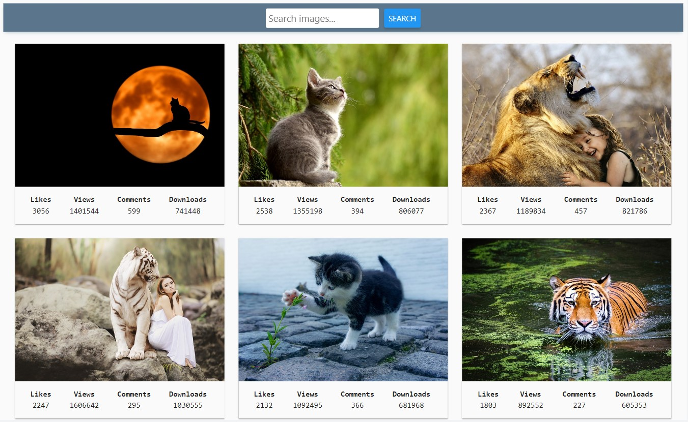
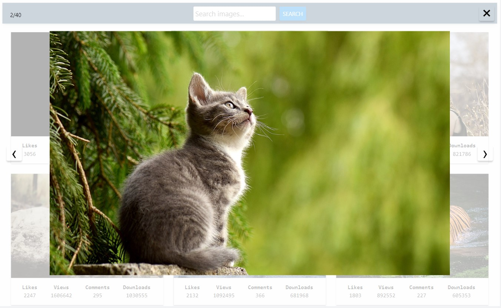
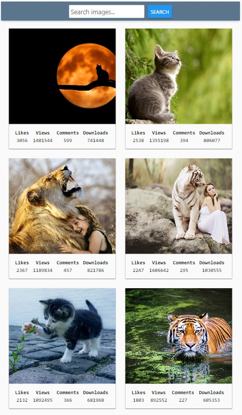
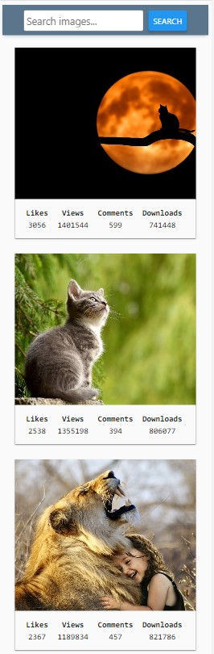

# A Simple Vanilla JS image search application with a responsive layout. 

This application provides users with the ability to search for images by keywords and view them in a simple, user-friendly interface. The project is built using Parcel. HTTP requests are made using the Axios library. Notifications are handled using the Notiflix library, making it easy to communicate with users. Code is formatted consistently and cleanly using Prettier.

This project is available at https://anette1983.github.io/image-search-app/

## Features

- Keyword Search Form: Easily search for images by entering keywords into the search form.

- Image Viewer: View the search results with a built-in image viewer.

- Responsive Layout: The application is designed to work seamlessly on various screen sizes, from desktop to mobile devices.

- SimpleLightbox Gallery: Enjoy a full gallery experience with large image display using the SimpleLightbox library.

- Smooth Page Scrolling: After each request, the application smoothly scrolls to display the next group of images, creating a seamless browsing experience.

- Error Handling: If there are no matches for a search query, a notification is displayed: "Sorry, there are no images matching your search query. Please try again."

- Pagination Support: Search results are paginated, with each response containing 40 image objects. The "Load More" button allows users to request the next group of images.

- Smart Load More Button: The "Load More" button is managed based on the available content. Initially hidden, the "Load More" button appears in the interface after the first request only if there is more than one page of images available. When re-submitting the form, the button is first hidden and then displayed after the request.

## Backend info

This application uses the public API provided by Pixabay as its backend service for fetching images.

- [Documentation](https://pixabay.com/api/docs/)

## Screenshots

 

